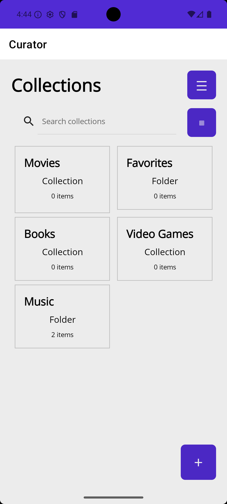
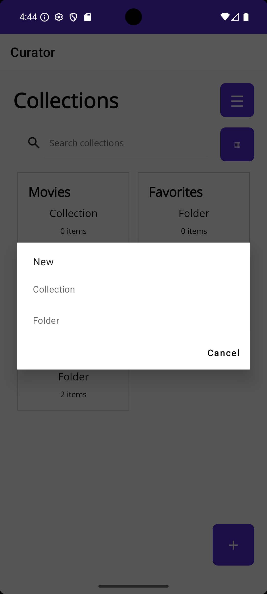
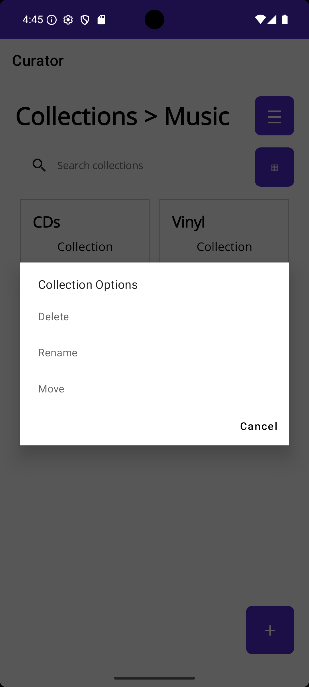

# Curator

Curator is an Android collection-management app built with **C# and .NET MAUI**. It is designed to provide a simple, flexible way to organize and browse personal collections without requiring accounts, subscriptions, or unnecessary cloud services.

> **Status:** Curator is currently under active development. Core functionality is working, but features and UI are still evolving.

## Features

- Create and manage multiple collections
- Local data storage
- No account or login required
- Designed with minimal permissions and user control of data in mind

## Screenshots

### Collections


### Creating Collections and Folders


### Collection Management


## Why Curator?

Curator started as a personal project to solve a simple problem: keeping track of collections without needing a specialized app for every type of collection.

Rather than being designed specifically for books, movies, games, or any other particular category, Curator is intended to be flexible enough for users to define and organize their own collections.

It has also become a way for me to explore modern Android application development and expand my experience with C# and the .NET ecosystem.

## Built With

- **C#**
- **.NET MAUI**
- **XAML**
- **.NET**
- **SQLite**
- **Android**
- **Git / GitHub**

## Development Goals

Curator is being developed around a few basic principles:

- Keep the interface simple
- Allow collections to be flexible rather than category-specific
- Keep user data portable
- Avoid requiring accounts when they aren't necessary
- Avoid unnecessary permissions
- Provide useful export and backup options


## Roadmap

Curator is under active development. See the [project roadmap](ROADMAP.md) for planned features and future development.

The roadmap will continue to evolve as the application develops.


## Building Curator

Curator is currently developed using .NET MAUI and targets Android.

### Requirements

- A supported .NET SDK
- The .NET MAUI workload
- Android SDK and development tools

### Clone the Repository

```bash
git clone https://github.com/cfbock/Curator.git
cd Curator
```

Open the solution in a .NET MAUI-compatible development environment and build the Android target.

More detailed build instructions will be added as the project approaches a public release.

## Project Status

Curator is a **work in progress** and is currently being shared primarily as a software-development portfolio project.

Expect changes to the UI, architecture, and features as development continues.

## License

Copyright © 2026 Christopher Bock.

No license has currently been granted for redistribution or reuse of the source code.